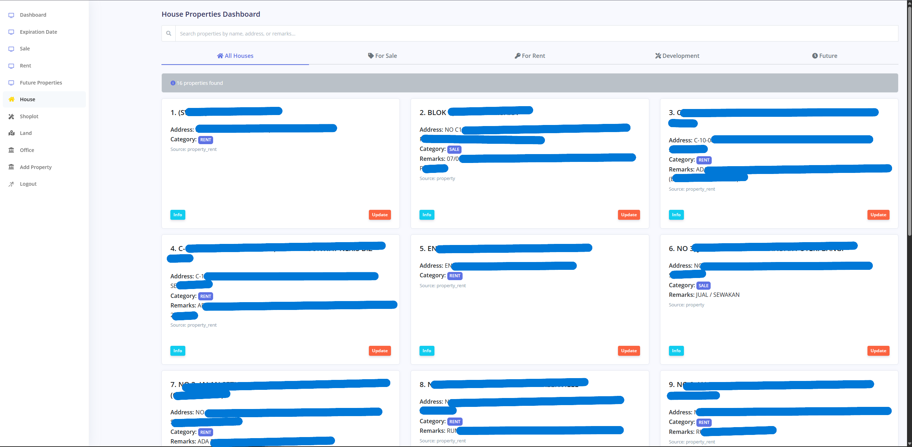
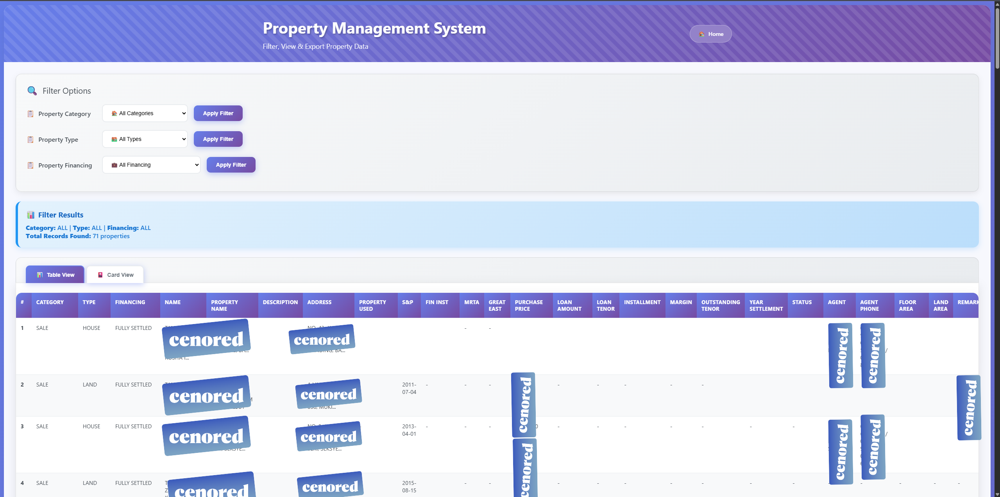
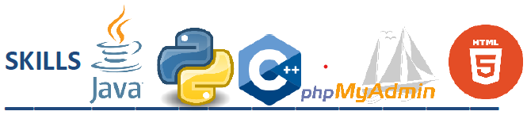
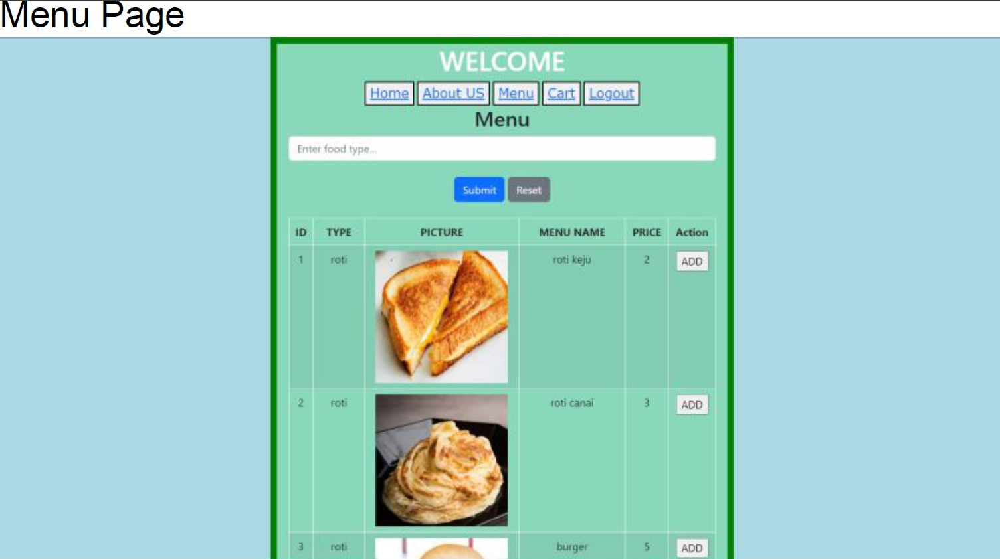
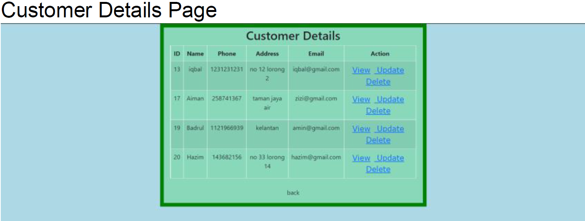

# 👨‍💻 MUHAMMAD IQBAL BIN SUHAIDIN
*Backend Developer | Full-Stack Developer | Computer Science Graduate*

  
  
  

    Computer Science graduate passionate about backend and full-stack development, with proven hands-on experience in building web applications. Skilled in backend development, database management, web design, and machine learning applications. Experienced in delivering real-world projects using PHP, MySQL, Python, C#, and modern web technologies. Strong problem-solving and collaborative skills with a focus on scalable, maintainable solutions.
  

## 🎓 Education

  

    <h3>🎯 Bachelor of Computer Science (Honours)</h3>
    
<strong>Universiti Teknologi MARA, Kampus Cawangan Kuala Terengganu, Malaysia</strong>

    
<em>October 2021 – June 2024</em>

    
Second Class (Upper), CGPA 3.0

  

  
  

    <h3>📚 Diploma in Computer Science</h3>
    
<strong>Universiti Teknologi MARA, Kampus Sunagai Petani Cawangan Kedah, Malaysia</strong>

    
<em>June 2018 – August 2021</em>

  

## 💼 Work Experience

  
🚀 Backend Developer

  
Menang Idaman SDN BHD

  
February 2025 – Present

  
  
Designed and developed a responsive, web-based Property Management System using PHP and phpMyAdmin for database management, hosted on cPanel. Key features and capabilities include:

  
  <ul>
    <li>🗃️ Developed and managed a custom database to support both Sales & Purchase (S&P) and Rental property records</li>
    <li>📎 Enabled each form to support the upload of unlimited images and documents, with strict validation:
      <ul>
        <li>Accepts only valid file types (e.g., images for image fields, documents for document fields)</li>
        <li>Rejects file uploads exceeding 50MB with appropriate warning messages</li>
      </ul>
    </li>
    <li>✅ Displays validation alerts for any missing required input fields</li>
    <li>📊 Developed a dashboard interface with data presented across tabbed views</li>
  </ul>
  
  

    
    
  

  
  <ul>
    <li>🔧 Built full data management functionality, allowing users to view, edit, delete, and replace property information</li>
    <li>📋 Integrated a History Tracking System to log all user actions</li>
    <li>🏠 For Rental properties, added a Tenant History feature to archive previous data</li>
    <li>🖨️ Enabled printing and PDF export of property data, images, and documents</li>
    <li>📱 Designed the system to be mobile-friendly for on-the-go access</li>
    <li>🔐 Implemented role-based access control (Admin vs Staff users)</li>
    <li>⏰ Integrated an "Expiration Monitoring" page to flag properties nearing rental end dates</li>
  </ul>
  
  

    
    
  

  
  
<strong>Additional Responsibilities:</strong> Provided IT support and designed WordPress websites including <a href="https://amanilife.my/" target="_blank">amanilife.my</a> with integrated e-commerce functionality and SEO optimization.

  
🌠Web Designer and Postmaster Admin

  
Ministry of Health headquarters, Presint 1, Putrajaya

  
September 2024 – December 2024

  
  <ul>
    <li>🎨 Designed and developed several new website layouts to replace outdated designs</li>
    <li>📧 Managed and maintained the Postmaster system, blasting critical emails to government entities</li>
    <li>🔧 Ensured modern functionality and user experience across all platforms</li>
  </ul>

  
💻 IT Support & Web Developer Intern

  
Kulim Technology Park Corporation SDN BHD, Kulim, Kedah

  
March 2024 – June 2024

  
  <ul>
    <li>🏌️ Developed a WordPress website for <a href="https://www2.kulimgolf.com.my/" target="_blank">Kulim Golf & Country Resort</a></li>
    <li>⚡ Updated the e-procurement website to a new C# .NET version</li>
    <li>🔧 IT support: Managed setup, installation, reset, and troubleshooting for company systems</li>
    <li>🎪 Event Participation:
      <ul>
        <li>Exhibitor at KIDEC 2024: Explained KDC functions, demonstrated 3D printing, and conducted mini drone tutorials</li>
        <li>Facilitated STEM4FUN: Introduced primary students to coding and Microsoft MakeCode</li>
        <li>Assisted in Peneraju Tunas BRIDGE Bestari: Set up equipment and documented activities</li>
      </ul>
    </li>
  </ul>

  
👨‍💻 Software Developer Intern

  
Pejabat Daerah & Tanah, Alor Setar, Kedah

  
October 2020 – December 2020

  
  <ul>
    <li>🏢 Developed a system (Sistem Penyimpanan Barang) for managing office items and assets using Java with NetBeans</li>
    <li>🔐 Implemented features such as login/logout for administrators</li>
    <li>📊 Created asset value calculation functionality (monthly and yearly)</li>
    <li>🔄 Performing CRUD operations (create, read, update, delete) and search functionality</li>
    <li>🗄️ Utilized XAMPP with MySQL for database management</li>
    <li>🎬 Created promotional materials including posters and a corporate video</li>
  </ul>

## 🛠️ Skills

  

    
  

  
  

    <h3>💻 Programming Languages</h3>
    

      Python
      Java
      C++
      C#
      PHP
      SQL
      HTML
      CSS
    

  

  
  

    <h3>🔧 Tools & Software</h3>
    

      Visual Studio
      VS Code
      Laragon
      XAMPP
      SSMS
      GitHub
    

  

  
  

    <h3>🤖 Machine Learning</h3>
    

      Random Forest
      Decision Tree
      KNN
      SVC
    

  

  
  

    <h3>🌍 Languages</h3>
    

      Bahasa Melayu
      English
    

  

## 🚀 Projects

  
🫀 Heart Disease Prediction Using Random Forest

  
  
  
  

    <h4>🎯 Overview</h4>
    
Developed a comprehensive machine learning application for predicting heart disease using multiple algorithms.

    
    <h4>🔧 Technical Implementation</h4>
    <ul>
      <li>🐍 Developed in Python without external machine-learning libraries</li>
      <li>🌳 Implemented the Random Forest algorithm from scratch</li>
      <li>📊 Utilized K-Nearest Neighbors (KNN) algorithm for additional analysis</li>
      <li>🎯 Employed Support Vector Classifier (SVC) for comprehensive analysis</li>
      <li>🖥️ Implemented user-friendly GUI using Streamlit</li>
      <li>📋 Allows users to input 13 features from patient's medical records</li>
      <li>⚡ Simple prediction process with one-click execution</li>
    </ul>
    
    <h4>📈 Results</h4>
    
Provides clear interpretation: 'heart disease' indicates presence of condition, 'no heart disease' signifies patient's overall health.

  

  
🾠Animal Recognition Using CNN

  
  
  
  

    <h4>🎯 Overview</h4>
    
Machine learning application for animal classification using deep learning techniques.

    
    <h4>🔧 Technical Implementation</h4>
    <ul>
      <li>📊 Developed in MATLAB</li>
      <li>🧠 Implemented Convolutional Neural Network (CNN) for machine learning</li>
      <li>🖼️ Incorporated advanced Image Processing techniques</li>
      <li>📁 User-friendly interface with 'browse' button for image selection</li>
      <li>🔍 Real-time image display on program interface</li>
      <li>⚡ One-click prediction using 'Scan' button</li>
      <li>🎯 Accurate animal class recognition and display</li>
    </ul>
  

  
🔠Online Ordering System

  
  

    
    
    
  

  
  

    <h4>🎯 Overview</h4>
    
Full-featured web-based food ordering system with customer and admin functionalities.

    
    <h4>🔧 Technical Implementation</h4>
    <ul>
      <li>🌐 Developed using HTML, CSS, and PHP</li>
      <li>🏠 Leveraged Laragon as local development environment</li>
      <li>🗄️ Utilized MySQL for robust database management</li>
      <li>👤 User registration and authentication system</li>
      <li>🛒 Shopping cart functionality with add/remove items</li>
      <li>🎨 Clean, intuitive GUI for food browsing</li>
      <li>👨‍💼 Admin panel with comprehensive order management</li>
      <li>📊 Full CRUD operations for order management</li>
    </ul>
  

  
💰 Loan Prediction System

  
  
  
  

    <h4>🎯 Overview</h4>
    
Advanced machine learning system for predicting loan repayment capability.

    
    <h4>🔧 Technical Implementation</h4>
    <ul>
      <li>🐍 Built entirely using Python</li>
      <li>🧹 Comprehensive data preprocessing and cleaning</li>
      <li>📊 Exploratory Data Analysis with correlation heatmaps</li>
      <li>⚖️ Advanced sampling and balancing techniques</li>
      <li>🎯 Multiple algorithm implementation for accuracy</li>
      <li>📈 Feature filtering and optimization</li>
    </ul>
    
    <h4>📈 Key Features</h4>
    <ul>
      <li>Removed irrelevant features and encoded categorical variables</li>
      <li>Standardized features by removing unnecessary symbols</li>
      <li>Addressed class imbalance through downsampling</li>
      <li>Separate datasets for training, testing, and evaluation</li>
    </ul>
  

  
👥 Client Management System (C# CRUD)

  
  
  
  

    <h4>🎯 Overview</h4>
    
Desktop application demonstrating complete CRUD operations for client management.

    
    <h4>🔧 Technical Implementation</h4>
    <ul>
      <li>💻 Developed using C# in Visual Studio</li>
      <li>🗄️ SQL Server Management Studio (SSMS) for database management</li>
      <li>🔄 Complete CRUD (Create, Read, Update, Delete) operations</li>
      <li>🎨 Professional desktop interface design</li>
      <li>🔐 Secure database connections and operations</li>
    </ul>
  

## 🏆 Awards

  <h3>🥈 Silver Award - Heart Disease Prediction Using Random Forest</h3>
  
  
Recognition for outstanding achievement in machine learning and healthcare technology innovation.

## 📞 Contact Information

  

    <strong>📍 Address:</strong> Seri Kembangan 43300, Selangor, Malaysia
  

  

    <strong>📱 Mobile:</strong> <a href="tel:+60196356149" style="color: white;">+6019-6356149</a>
  

  

    <strong>📧 Email:</strong> <a href="mailto:iqbal22shd@gmail.com" style="color: white;">iqbal22shd@gmail.com</a>
  

  

    <strong>🚗 License:</strong> Motorcycle and Car
  

  

    <strong>💼 LinkedIn:</strong> <a href="https://my.linkedin.com/in/iqbal-suhaidin-560a452a8" target="_blank" style="color: white;">Connect with me</a>
  

---

  
💼 Ready for new opportunities and challenging projects!

  
🚀 Let's build something amazing together!

              
